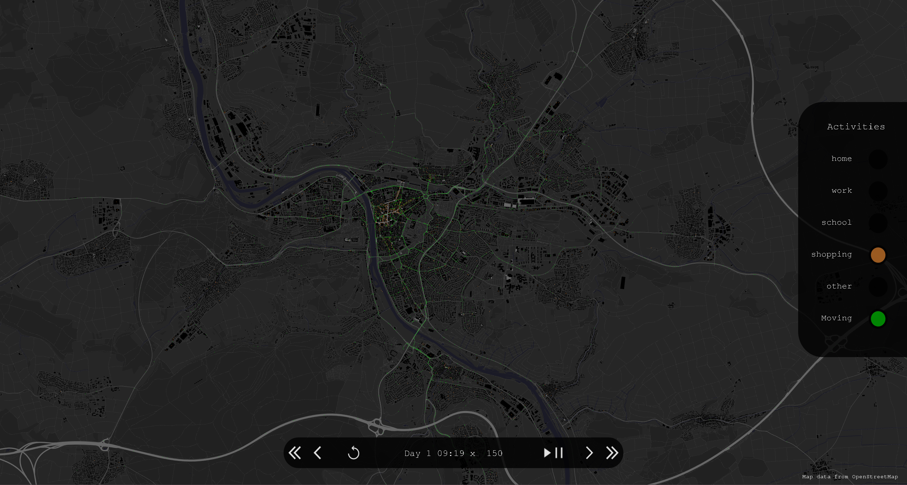

# OMoSim: An Open Mobility Demand Simulator

Omosim (formerly known as OMOD) is a tool that creates synthetic mobility demand based on OpenStreetMap data
for a user-defined location.
The generated demand describes what an agent *plans* to do on a given day
in the form of daily activity diaries ([output example](#output)).

Technically, Omosim will run for any location on Earth.
However, we calibrated the model using data from the German national household travel survey
(https://www.mobilitaet-in-deutschland.de/publikationen2017.html).
Therefore, the model's performance outside of Germany,
especially in nations with very different conditions,
is uncertain.
Additionally, the region must be mapped reasonably well in OpenStreetMap.
Especially important is good information about the size and location of buildings, about land use zones, and the road network.
Census information is not required but helpful;
see this [code example](python_tools/format_zensus2011.py) of how to correctly format census data for Omosim.

With Version 2.2 and above you can also use [Overture Maps](https://overturemaps.org) instead of OSM for building and POI data,
which is more complete in certain parts of the world (e.g., South Korea).

Publications:
- The methodology behind the demand generation process is explained in the publication [OMOD: An open-source tool for creating disaggregated mobility demand based on OpenStreetMap](https://doi.org/10.1016/j.compenvurbsys.2023.102029)
- The methodology behind the mode choice model is explained in the publication [Transport Mode Choice for Disaggregated Mobility Demand Generation](https://ieeexplore.ieee.org/abstract/document/11003939)

## Contents
- [Get Started](#get-started)
- [Output formats](#output)
- [Visualization](#visualization)
- [Routing Mode](#routing-mode)
- [Population Definition](#population-definition)
- [Calibration](#calibration)
- [Usage as Java Library](#usage-as-java-library)
- [CLI-Options](#cli-options)
- [API Reference](#documentation)

## Get Started

You need Java 21 or later.

1. Download the latest release of Omosim (see *Releases* on the right)
2. Download OSM data of the region you are interested in as an osm.pbf.The file can cover a larger area than the area of interest, but too large files slow down initialization. Recommended download site: https://download.geofabrik.de/
3. Get a GeoJson of the region you want to simulate. This region must be covered by the osm.pbf file. With https://geojson.io, you can easily create a geojson of an arbitrary region. Geojsons for administrative areas can be obtained quickly with https://polygons.openstreetmap.fr/.
4. Run Omosim:

   ```
   java -jar omosim-2.3.0-all.jar Path/to/GeoJson Path/to/osm.pbf 
   ```

There are multiple optional cli arguments, such as the number of agents, the number of days, or the population definition.
See all [cli options here](#CLI-Options) or run --help.

## Output

Default output format (see [JsonExample.json](doc/outputFormats/JsonExample.json)):

```
{
    "runParameters": {
        ...
    },
    "agents": [
       {
           "id": 0,                          // ID of the agent/person
           "homogenousGroup": "UNDEFINED",   // Options: WORKING, NON_WORKING, PUPIL_STUDENT, UNDEFINED
           "mobilityGroup": "UNDEFINED",     // Options: CAR_USER, CAR_MIXED, NOT_CAR, UNDEFINED
           "age": null,                      // Int?
           "sex": "UNDEFINED",               // Options:  MALE, FEMALE, UNDEFINED
           "carAccess": false,               // Boolean
           "mobilityDemand": [               // Generated mobility demand
               {
                   "day": 0,                 // Zero indexed day number
                   "dayType": "UNDEFINED",   // Options: MO, TU, WE, TH, FR, SA, SU, HO, UNDEFINED; HO = Holiday
                   "plan": [                 // Mobility plan for a given day. Activities - Trip - Activity - ... - Activity
                       {
                           "type": "Activity",                    // Either "Activity" or "Trip"
                           "legID": 0,                            // Index in the daily plan (count continues for both activities and trips)
                           "activityType": "HOME",                // Options: HOME, WORK, SCHOOL, SHOPPING, OTHER
                           "startTime": "00:00",                  
                           "stayTimeMinute": 346.3270257434699,   // Time spent at location. Unit: Minutes. Always Null for the last activity: means "until end of day"
                           "lat": 49.770390415910654,             // Latitude
                           "lon": 9.926447964597246,              // Longitude
                           "dummyLoc": false,                     // Placeholder for calibration: currently always false
                           "inFocusArea": true                    // Is that location inside the area defined by the GeoJson?
                       },
                       {
                           "type": "Trip",
                           "legID": 1,
                           "mode": "BICYCLE",                        // Transport mode of trip. Options: CAR_DRIVER, CAR_PASSENGER, PUBLIC_TRANSIT, BICYCLE, FOOT, UNDEFINED
                           "startTime": "05:46",                  
                           "distanceKilometer": 5.9415048636329315,  // Trip distance. Unit: Kilometer
                           "timeMinute": 21.0,                       // Trip duration. Unit: Minute
                           "lats": [ 49.7704712, 49.7714712, 49.77499469890436 ],  // Trip path coordinates. Only returned when --return_path_coords y 
                           "lons": [ 9.9266363, 9.9264601, 9.874013608000029]
                           ]
                       },
                       {
                           "type": "Activity",
                           "legID": 2,
                           "activityType": "WORK",
                           "startTime": "06:07",
                           "stayTimeMinute": 553.6428611125708,
                           "lat": 49.77492197538944,
                           "lon": 9.873904883397765,
                           "dummyLoc": false,
                           "inFocusArea": false
                       },
                       ...
                   ]
               },
               ...
           ]
       },
       ...
    ]
}
```

Other possible output formats are [MATSim population .xml files](doc/outputFormats/MATSimExample.xml) and
[SQLite](doc/outputFormats/SQLiteStructure.md).
The output format is inferred from the given output file extension.

## Visualization

A visualization tool for Omosim is available at: https://github.com/L-Strobel/omosim-visualizer

<p align="center">
   
</p>

## Routing Mode

Omosim determines the destination choice of agents based on a gravity model.
The necessary distances from A to B can be calculated with the
routing mode GraphHopper and Beeline.
The first calculates the distance by car using the open-source router GraphHopper
(https://github.com/graphhopper/graphhopper).
This mode leads to the best result.
However, it also takes significantly longer to compute.
Luckily, most heavy computations can be cached.
Therefore, the first run is slow, but subsequent runs are fast.
The second mode uses the Euclidean distance
and is significantly faster but less precise.

Change the routing mode with the CLI flag *\--routing_mode* to either *GRAPHHOPPER* or *BEELINE*.

## Population Definition

It is possible to separate the population into different strata/groups and assign each individual properties (--population_file=*path\to\file*).

Example:

```
[
  {
    "stratumName": "Young Generation",  // Can be chosen freely
    "stratumShare": 0.5,                // Must add up to 1.0 with the shares of the other strata
    "carOwnership": 0.30,               // Share of car ownership in the group
    "age": {                            
      "limits": [10, 20, 30],           // Defines the age distribution of the stratum. The limits define the upper bounds of each bin. Inside each bin, the distribution is uniform. For example, here, 25% of the group is aged between 0 (inclusive) and 10 (exclusive).
      "shares": [0.25, 0.5, 0.25],      // These values combined with the value of 'UNDEFINED' must add up to 1.0
      "UNDEFINED": 0.0
    },
    "homogenousGroup": {                // Shares of the hom. Groups in the stratum. Must add up to 1.0
      "WORKING":  0.0,
      "NON_WORKING": 0.0,
      "PUPIL_STUDENT": 0.0,
      "UNDEFINED": 1.0
    },
    "mobilityGroup": {                 // Shares of the mob. Groups in the stratum. Must add up to 1.0
      "CAR_USER": 0.2,
      "CAR_MIXED": 0.2,
      "NOT_CAR": 0.6,
      "UNDEFINED": 0.0
    },
    "sex": {                           // Shares of the sexes in the stratum. Must add up to 1.0
      "MALE": 0.5,
      "FEMALE": 0.5,
      "UNDEFINED": 0.0
    }
  },
  {
     "stratumName": "Old Generation",
     "stratumShare": 0.5,
     "carOwnership": 0.60,
     "age": {
        "limits": [30, 60, 80],
        "shares": [0.25, 0.5, 0.25],
        "UNDEFINED": 0.0
     },
     "homogenousGroup": {
        "WORKING":  0.0,
        "NON_WORKING": 0.0,
        "PUPIL_STUDENT": 0.0,
        "UNDEFINED": 1.0
     },
     "mobilityGroup": {
        "CAR_USER": 0.6,
        "CAR_MIXED": 0.2,
        "NOT_CAR": 0.2,
        "UNDEFINED": 0.0
     },
     "sex": {
        "MALE": 0.5,
        "FEMALE": 0.5,
        "UNDEFINED": 0.0
     }
  },
  ...
]
```

## [EXPERIMENTAL] Calibration

It is possible to calibrate Omosim with local data. Currently, only traffic count data is supported.
The entire calibration pipeline is experimental at this point.

### Calibration Input Format

*--calibration_traffic_count_file*

Calibration data is supplied as a file,
which must be a **semicolon**-separated CSV with the following format:

| name | counts | direction | geometry |
|------|--------|-----------|----------|
| TEXT | ARRAY  | REAL      | WKT      |

Example:

| name | counts      | direction | geometry                                                      |
|------|-------------|-----------|---------------------------------------------------------------|
| TC1  | [100, 1000] | 270       | POLYGON ((49.8 9.9, 49.7 9.9, 49.7 9.8, 49.8 9.8, 49.8 9.99)) |
| TC2  | [10, 300]   | 90        | POLYGON ((49.8 9.9, 49.7 9.9, 49.7 9.8, 49.8 9.8, 49.8 9.99)) |
| ...  | ...         | ...       | ...                                                           |

- *name*: Name of the traffic counting station. Can be any string.
- *count*: Traffic counts. Must be a string of the form "[x, y, z]", where each element represents a traffic count.
You can supply arbitrarily many counts. However, each sensor must have the same number of counts.
The counts are assumed to be evenly spaced over a single.
For example:
  - One count for the entire day: "[2000]"
  - 4h-intervals: "[100, 400, 1000, 1000, 400, 100]". The first value addresses the time frame from 00:00 - 03:59
the second from 04:00 - 08:00 and so on.
- *direction*: Direction in which the sensor counts traffic. Unit: degrees. 0: North,  90: East,  180: South, 270: West.
- *geometry*: Field of vision of the sensor. Each sensor is assumed to count traffic passing through its field of vision
that is moving in the direction specified by the *direction* column.

### Calibration Steps

*--calibration_steps*

This option defines what calibration steps will be applied.
You can give this option multiple times to run multiple steps consecutively.
Each step is of the format: TYPE:ALG:ACTIVITY,..:PARAMS

Example:

   ```
   --calibration_steps GRAVITY:SM_PSO:OTHER,WORK:iterations=1000:lb=0.2:ub=1.2 --calibration_steps EVALUATE::::
   
   ```

This will first calibrate the gravity model for the activities *Other* and *Work*
using the PSO algorithm with the surrogate model (SM).
The last three parameters are supplied to the optimization algorithm.
Here, they set the number of iterations to 1000 and the upper and lower bounds for location attraction values
to 20% and 120% of their original value.
The second step will evaluate the calibration results and print some metrics to standard output.

Each step must always contain 3 colons. If you want to use default values for algorithms, etc.,
you can leave the space between colons empty.

Options per step:

- TYPE: GRAVITY, MODE_CHOICE, ROUTE_CHOICE, EVALUATE

Currently only for GRAVITY:

- ALG: SM_LBFGS, SM_GD, SM_PSO, PSO, PSO_AO, SM_SPSA, SPSA, SPSA_AO, SM_WSPSA, WSPSA
- ACTIVITY: HOME, WORK, SCHOOL, SHOPPING, OTHER
- PARAMS: [See algorithm implementations](src/main/kotlin/de/uniwuerzburg/omosim/calibration/algorithms) 

The only supported order of steps currently is:

Gravity → Mode Choice → Route Choice

Evaluate can be put at any point, and steps can be repeated or excluded.

### Total population

*--calibration_population*

This option specifies the total population in the simulated area (including the buffer area).
Necessary if **no** census data is provided to scale up the simulated traffic to the actual expected traffic.

### Using the calibration

A calibration run will output files to the directory specified by the *--calibration_out_dir* option.
These can be supplied to a normal run with the options:
- *--calibration_file_gravity*: for gravity model calibration
- *--calibration_file_mode_choice*: for mode choice model calibration
- *--calibration_file_route_choice*: for route choice calibration

## Usage as Java library

First, add the jar to your classpath.

Basic example:

```java
import de.uniwuerzburg.omosim.core.Omosim;
import de.uniwuerzburg.omosim.core.models.MobiAgent;
import de.uniwuerzburg.omosim.core.models.Diary;
import de.uniwuerzburg.omosim.core.models.Weekday;
import de.uniwuerzburg.omosim.core.models.Activity;
import de.uniwuerzburg.omosim.core.models.ActivityType;

import java.util.LinkedList;
import java.io.File;
import java.util.List;

class App {
   public static void main (String[] args) {
      File areaFile = new File("Path/to/GeoJson");
      File osmFile = new File("Path/to/osm.pbf");
   
      // Create a simulator
      Omosim omosim = Omosim.Companion.defaultFactory(areaFile, osmFile);
   
      // Run for 1000 agents, an undefined start day, and 1 day
      List<MobiAgent> agents = omosim.run(1000, Weekday.UNDEFINED, 1);
   
      // Do something with the result. E.g. get conducted activities 
      List<ActivityType> activities = new LinkedList<ActivityType>();
      for (MobiAgent agent : agents) {
         for (Diary diary : agent.getMobilityDemand()) {
            for (Activity activity : diary.getActivities()) {
                activities.add(activity.getType());
            }
         }
      }
   }
}
```

## CLI Options

```
--n_agents=<int>             Number of agents to simulate. If
                             populate_buffer_area = y, additional agents are
                             created to populate the buffer area.
--share_pop=<float>          Share of the population to simulate. 0.0 = 0%,
                             1.0 = 100% If populate_buffer_area = y,
                             additional agents are created to populate the
                             buffer area.
--n_days=<int>               Number of days to simulate
--start_wd=(MO|TU|WE|TH|FR|SA|SU|HO|UNDEFINED)
                             First weekday to simulate. If the value is set
                             to UNDEFINED, all simulated days will be
                             UNDEFINED.
--out=<path>                 Output file. The output format is inferred from
                             the ending: '.json' -> Json, '.xml'-> MATSim,
                             '.db'-> SQLite
--routing_mode=(GRAPHHOPPER|BEELINE)
                             Distance calculation method for destination
                             choice. Either euclidean distance (BEELINE) or
                             routed distance by car (GRAPHHOPPER)
--od=<path>                  [Experimental] Path to an OD-Matrix in GeoJSON
                             format. The matrix is used to further calibrate
                             the model to the area using k-factors.
--census=<path>              Path to population data in GeoJSON format. For
                             an example of how to create such a file see
                             python_tools/format_zensus2011.py. Should cover
                             the entire area, but can cover more.
--grid_precision=<float>     Allowed average distance between a focus area
                             building and its corresponding TAZ center. The
                             default is 150m and suitable in most cases.In
                             the buffer area the allowed distance increases
                             quadratically with distance. Unit: meters
--buffer=<float>             Distance by which the focus area (defined by
                             GeoJSON) is buffered in order to account for
                             traffic generated by the surrounding. Unit:
                             meters
--seed=<int>                 RNG seed.
--cache_dir=<path>           Cache directory
--populate_buffer_area=true|false
                             Determines if home locations of agents can be
                             in the buffer area (so outside of the focus
                             area). If set to 'y' additional agents will be
                             created so that the proportion of agents in and
                             outside the focus area is the same as in the
                             census data. The focus area will always be
                             populated by n_agents agents.
--distance_matrix_cache_size=<int>
                             Maximum number of entries of the distance
                             matrix to precompute (only if routing_mode is
                             GRAPHHOPPER). A high value will lead to high
                             RAM usage and long initialization times but
                             overall significant speed gains. The default
                             value will use approximately 8 GB RAM at
                             maximum.
--mode_choice=(NONE|CAR_ONLY|GTFS|FAST)
                             Type of mode choice. NONE: Returns trips with
                             undefined modes.GTFS: Uses a logit model with
                             public transit as an option
--return_path_coords=true|false
                             Whether lat/lon coordinates of chosen trip
                             paths are returned.Paths only exist for trips
                             with defined modes and within the focus area +
                             buffer.
--population_file=<path>     Path to file that describes the
                             socio-demographic makeup of the population.
                             Must be formatted like
                             omosim/src/main/resources/Population.json.
--activity_group_file=<path> Path to file that describes the activity chains
                             for each population group and the dwell-time
                             distribution for the each chain. Must be
                             formatted like
                             omosim/src/main/resources/ActivityGroup.json
--n_worker=<int>             Number of parallel coroutines that can be
                             executed at the same time. Default: Number of
                             CPU-Cores available.
--gtfs_file=<path>           Path to an General Transit Feed Specification
                             (GTFS) for the area. Required for public
                             transit routing,for example if public transit
                             is an option in mode choice. Must be a .zip
                             file or a directory (see https://gtfs.org/).
                             Recommended download platform for Germany:
                             https://gtfs.de/
--mapdata_overture=<text>    Use overture map data instead of OSM for
                             buildings and POIs. Usage: --mapdata_overture
                             RELEASE. Where RELEASE is a valid overture
                             release. For an introduction to Overture Maps
                             see https://overturemaps.org/
--matsim_output_crs=<text>   CRS of MatSIM output. Must be a code understood
                             by org.geotools.referencing.CRS.decode().
--mode_speed_up=<value>      Value: MODE=FACTOR. Multiply the travel time of
                             each trip of the mode by the factor.Example:
                             CAR_DRIVER=0.3, will slow down car travel
                             durations by 70%.
--calibration_traffic_count_file=<path>
                             [EXPERIMENTAL] Traffic count data that serves as ground truth.
--calibration_steps=<value>  [EXPERIMENTAL] Defines one calibration step to undertake.
                             Format: TYPE:ALG:ACTIVITY?,..:PARAMS
                             Example:
                             GRAVITY:MM_PSO:OTHER,WORK:iterations=1000:lb=0.2
--calibration_out_dir=<path> [EXPERIMENTAL] Calibration output directory. Stores the result
                             of a calibration run.Calibration results will
                             be stored in this file with the names gravity,
                             mode choice, etc.
--calibration_population=<float>
                             [EXPERIMENTAL] Population of the area (focus + buffer).
                             Necessary input when no census data is
                             supplied. Used to scale the estimate traffic
                             counts.
--calibration_file_gravity=<path>
                             [EXPERIMENTAL] Calibration file to use for the gravity model
                             (destination choice). Generated by a
                             calibration run.
--calibration_file_mode_choice=<path>
                             [EXPERIMENTAL] Calibration file to use for mode choice.
                             Generated by a calibration run.
-h, --help                   Show this message and exit
```

## Documentation

An API reference is available at: https://L-Strobel.github.io/omosim

## Acknowledgment

This model is created as part of the ESM-Regio project (https://www.bayern-innovativ.de/de/seite/esm-regio-en)
and is made possible through funding from the German Federal Ministry for Economic Affairs and Climate Action.